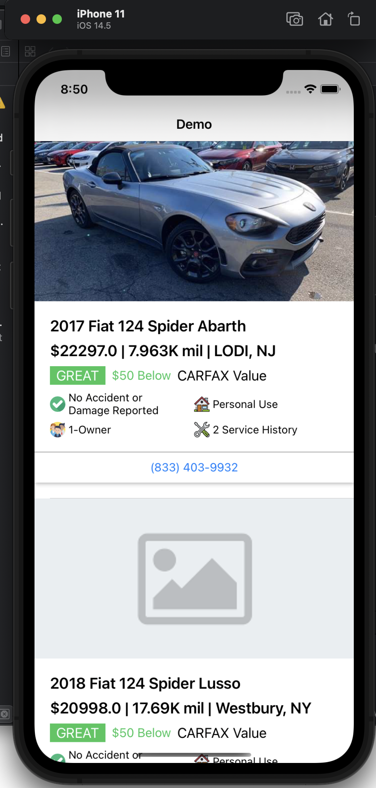

## Overview
This is just an interview demo to fetch data of the cars from API and display them on the UI

 

P/S: Some image urls in the API work but some don't. That's why I could display some car images. For those image urls not working, I couldn't display the car images (of course!).

## Development
It was developed in `Swift 5.0` with MVVM architecture

## API
[here](https://carfax-for-consumers.firebaseio.com/assignment.json)

